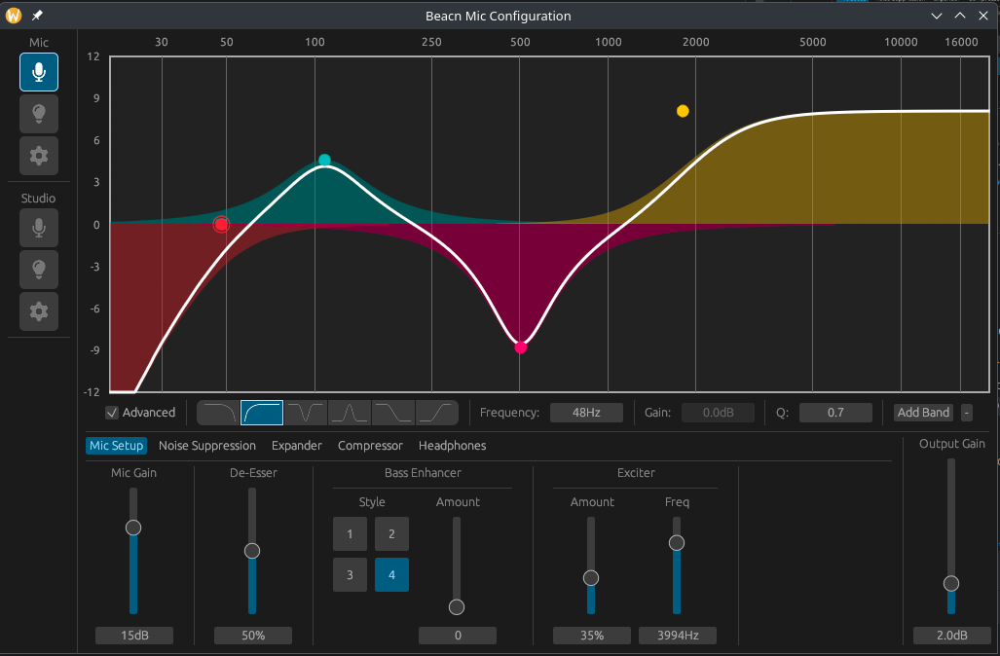

# Beacn Mic / Beacn Studio UI for Linux

A UI for configuring the Beacn Mic or Beacn Studio on Linux. Join us on [Discord](https://discord.gg/PdsscuEhMh).

***

### USE AT YOUR OWN RISK

This code directly modifies the on-board storage of the Beacn Device. While it's been tested and made to be as safe as
is possible, it was derived from reverse engineering and thus may not be accurate.

This project is not supported by, or affiliated in any way with Beacn. For official Beacn software, please refer
to their website.

In addition, this project accepts no responsibility or liability for any use of this software, or any problems
which may occur from its use. Please read the LICENSE for more information.

***


Currently, this tool is quite barebones and basic and is likely going to stay that way, it's just for adjusting
values on the Mic or Studio. This app may also might be slightly buggy, so expect issues. The Beacn Mic and Studio have
on-board storage so values changed here should persist across device reboots.
***

## Getting Started

### Setting Up Beacn Devices on Linux

1) Install the [ALSA UCM profiles](https://github.com/beacn-on-linux/beacn-ucm-profiles) for the Beacn Hardware.
2) Copy `50-beacn-mic.rules` from this repository to `/etc/udev/rules.d/`
3) Run `sudo udevadm control --reload-rules && sudo udevadm trigger`
4) Unplug, then re-plug your Beacn Mic

Once that's done, your Beacn Mic should show up with a 'Headphones' and 'Microphone' channel.

### Running this App

If you simply want to just run this app, you can do so with the following:

1) Check out this repository
2) Run `cargo run --release`

### Building this App

If you instead want to build the app and have a useful binary you can link to:

1) Check out this repository
2) Run `cargo build --release`
3) Grab `target/release/beacn-mic-ui`

***

## Getting Started (flatpak)

It is *HIGHLY* recommended that you do this on a fresh clone of the repo, and not on the working tree, just
to help prevent spill over from occurring.

### First time setup
Firstly, install the `flatpak-builder` package for your distribution.

Create a Python Environment to work with, then activate it: 
```sh 
python -m venv ~/.python_beacn/
source ~/.python_beacn/bin/activate
```

Install the cargo generator package:
```sh
pip install flatpak-cargo-generator
```

Generate the Flatpak build dependencies:
```sh
flatpak-cargo-generator Cargo.lock -o generated-sources.json
```

Perform the First Build
```shell
flatpak-builder --repo=repo --install-deps-from=flathub --force-clean build-dir com.github.beacn-on-linux.yml
```

Create a local flatpak remote, and install our built app to it
```shell
flatpak --user remote-add --no-gpg-verify beacn-repo repo
flatpak install --user beacn-repo com.github.beacn-on-linux
```

### Future Builds
To update the installed package, update the repository from git then run the following:
```shell
source ~/.python_beacn/bin/activate
flatpak-cargo-generator Cargo.lock -o generated-sources.json
flatpak-builder --repo=repo --install-deps-from=flathub --force-clean build-dir com.github.beacn-on-linux.yml
flatpak update
```

## Current Project Status

Not Yet Implemented:
* Lighting
* Probably a button or two, let me know if you spot one.

Not (currently) Planned:
* Profiles
* Audio Visualisations

***

This tool may eventually be merged into a 'Bigger' app that includes other Beacn devices, this will happen as and
when time permits and devices are handled.